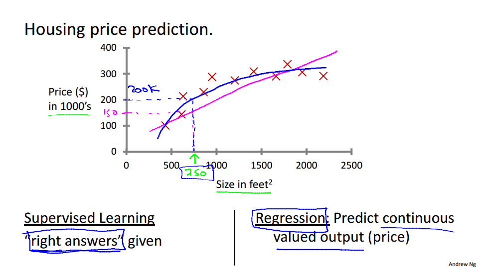

# 1 引言（Introduction）

## 1.1 Welcome

随着互联网数据不断累积，硬件不断升级迭代，在这个信息爆炸的时代，机器学习已被应用在各行各业中，可谓无处不在。

一些常见的机器学习的应用，例如：

- 手写识别
- 垃圾邮件分类
- 搜索引擎
- 图像处理
- …

使用到机器学习的一些案例：

- 数据挖掘
  - 网页点击流数据分析
- 人工无法处理的工作（量大）
  - 手写识别
  - 计算机视觉
- 个人定制
  - 推荐系统
- 研究大脑
- ……

## 1.2 什么是机器学习（What is Machine Learning）
1. 机器学习定义
    这里主要有两种定义：

  - Arthur Samuel (1959). Machine Learning: 

    Field of study that gives computers the ability to learn without being explicitly programmed.

    这个定义有点不正式但提出的时间最早，来自于一个懂得计算机编程的下棋菜鸟。他编写了一个程序，但没有显式地编程每一步该怎么走，而是让计算机自己和自己对弈，并不断地计算布局的好坏，来判断什么情况下获胜的概率高，从而积累经验，好似学习，最后，这个计算机程序成为了一个比他自己还厉害的棋手。

  - Tom Mitchell (1998) Well-posed Learning Problem: 

    A computer program is said to learn from experience E with respect to some **task T** and some **performance measure P**, if its performance on T, as measured by P, improves with **experience E**. 

    Tom Mitchell 的定义更为现代和正式。在过滤垃圾邮件这个例子中，电子邮件系统会根据用户对电子邮件的标记（是/不是垃圾邮件）不断学习，从而提升过滤垃圾邮件的准确率，定义中的三个字母分别代表：
    
    - T(Task): 过滤垃圾邮件任务。
    - P(Performance): 电子邮件系统过滤垃圾邮件的准确率。
    - E(Experience): 用户对电子邮件的标记。

2. 机器学习算法

   主要有两种机器学习的算法分类

   1. 监督学习
   2. 无监督学习

   两者的区别为**是否需要人工参与数据结果的标注**。这两部分的内容占比很大，并且很重要，掌握好了可以在以后的应用中节省大把大把的时间~

   还有一些算法也属于机器学习领域，诸如：

   - 半监督学习: 介于监督学习于无监督学习之间
   - 推荐算法: 没错，就是那些个买完某商品后还推荐同款的某购物网站所用的算法。
   - 强化学习: 通过观察来学习如何做出动作，每个动作都会对环境有所影响，而环境的反馈又可以引导该学习算法。
   - 迁移学习

## 1.3 监督学习（Supervised Learning）
监督学习，即为教计算机如何去完成预测任务（有反馈），预先给一定数据量的输入**和对应的结果**即训练集，建模拟合，最后让计算机预测未知数据的结果。

监督学习一般有两种：

1. 回归问题（Regression）

   回归问题即为预测一系列的**连续值**。

   在房屋价格预测的例子中，给出了一系列的房屋面积数据，根据这些数据来预测任意面积的房屋价格。给出照片-年龄数据集，预测给定照片的年龄。

   

2. 分类问题（Classification）

   分类问题即为预测一系列的**离散值**。

   即根据数据预测被预测对象属于哪个分类。

   视频中举了癌症肿瘤这个例子，针对诊断结果，分别分类为良性或恶性。还例如垃圾邮件分类问题，也同样属于监督学习中的分类问题。

   

视频中提到**支持向量机**这个算法，旨在解决当特征量很大的时候（特征即如癌症例子中的肿块大小，颜色，气味等各种特征），计算机内存一定会不够用的情况。**支持向量机能让计算机处理无限多个特征。**

## 1.4 无监督学习（Unsupervised Learning）

相对于监督学习，训练集不会有人为标注的结果（无反馈），我们**不会给出**结果或**无法得知**训练集的结果是什么样，而是单纯由计算机通过无监督学习算法自行分析，从而“得出结果”。计算机可能会把特定的数据集归为几个不同的簇，故叫做聚类算法。

无监督学习一般分为两种：
1. 聚类（Clustering）
   - 新闻聚合
   - DNA 个体聚类
   - 天文数据分析
   - 市场细分
   - 社交网络分析
2. 非聚类（Non-clustering）
   - 鸡尾酒问题

**新闻聚合**

在例如谷歌新闻这样的网站中，每天后台都会收集成千上万的新闻，然后将这些新闻分组成一个个的新闻专题，这样一个又一个聚类，就是应用了无监督学习的结果。

**鸡尾酒问题**

在鸡尾酒会上，大家说话声音彼此重叠，几乎很难分辨出面前的人说了什么。我们很难对于这个问题进行数据标注，而这里的通过机器学习的无监督学习算法，就可以将说话者的声音同背景音乐分离出来，看视频，效果还不错呢\~~。

嗯，这块是打打鸡血的，只需要一行代码就解决了问题，就是这么简单！当然，我没复现过 \^\_\^……

神奇的一行代码：
`[W,s,v] = svd((repmat(sum(x.*x,1),size(x,1),1).*x)*x');`

**编程语言建议**

在机器学习刚开始时，**推荐使用 Octave 类的工程计算编程软件**，因为在 C++ 或 Java 等编程语言中，编写对应的代码需要用到复杂的库以及要写大量的冗余代码，比较耗费时间，建议可以在学习过后再考虑使用其他语言来构建系统。
另外，在做**原型搭建**的时候也应该先考虑使用类似于 Octave 这种便于计算的编程软件，当其已经可以工作后，才将模型移植到其他的高级编程语言中。

> 注：Octave 与 MATLAB 语法相近，由于 MATLAB 为商业软件，课程中使用开源且免费的 Octave。
>
> 机器学习领域发展迅速，现在也可使用 Tensorflow 等开源机器学习框架编写机器学习代码，这些框架十分友好，易于编写及应用。

