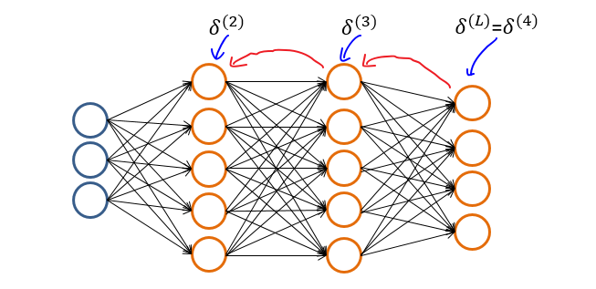
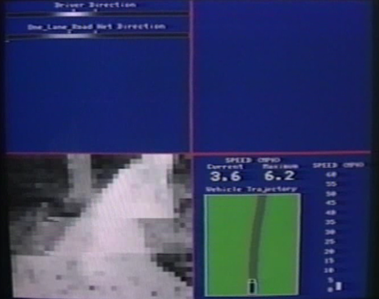

# 9 神经网络: 学习（Neural Networks: Learning）

## 9.1 代价函数（Cost Function）

神经网络的分类问题有两种：

- 二元分类问题（0/1分类）

  只有一个输出单元（$K=1$）

- 多元（$K$）分类问题

  输出单元不止一个（$K\gt1$）

神经网络的代价函数公式：

$ h_\Theta(x) = a^{(L)} = g(\Theta^{(L-1)}a^{(L-1)}) = g(z^{(L)}) $

$$ \begin{gather*} J(\Theta) = - \frac{1}{m} \sum_{i=1}^m \sum_{k=1}^K \left[y^{(i)}_k \log ((h_\Theta (x^{(i)}))_k) + (1 - y^{(i)}_k)\log (1 - (h_\Theta(x^{(i)}))_k)\right] + \frac{\lambda}{2m}\sum_{l=1}^{L-1} \sum_{i=1}^{s_l} \sum_{j=1}^{s_{l+1}} ( \Theta_{j,i}^{(l)})^2\end{gather*}$$

> $L$: 神经网络的总层数
>
> $s_l$: 第 $l$ 层激活单元的数量（不包含偏置单元）
>
> $h_\Theta(x)_k$: 分为第 $k$ 个分类($k^{th}$)的概率 $P(y=k | x ; \Theta) $
>
> $K$: 输出层的输出单元数量，即类数 - 1
>
> $y_k^{(i)}$: 第 $i$ 个训练样本的第 $k$ 个分量值
>
> $y$: $K$ 维向量
>
> 
>
> 注：此处符号表达和第四周的内容有异有同，暂时先按照视频来，有必要的话可以做下统一.

公式可长可长了是吧，但是不是有些熟悉？对照下逻辑回归中的代价函数：

$$
J(\theta) = - \frac{1}{m} \sum_{i=1}^m [ y^{(i)}\ \log (h_\theta (x^{(i)})) + (1 - y^{(i)})\ \log (1 - h_\theta(x^{(i)}))] + \frac{\lambda}{2m}\sum_{j=1}^n \theta_j^2
$$

在神经网络的代价函数中，

- 左边的变化实际上是为了求解 $K$ 分类问题，即公式会对每个样本特征都运行 $K$ 次，并依次给出分为第 $k$ 类的概率，$h_\Theta(x)\in \mathbb{R}^{K}, y \in \mathbb{R}^{K}$。
- 右边的正则化项比较容易理解，每一层有多维矩阵 $\Theta^{(l)}\in \mathbb{R}^{(s_l + 1)\times s_{l+1}}$，从左到右看这个三次求和式 $\sum\limits_{l=1}^{L-1}\sum\limits_{i=1}^{s_l}\sum\limits_{j=1}^{s_{l+1}}$ ，就是对每一层间的多维矩权重 $\Theta^{(l)}$ ，依次平方后求取其除了偏置权重部分的和值，并循环累加即得结果。

> $\mathbb{R}^{m}$: 即 $m$ 维向量
>
> $\mathbb{R}^{m\times n}$: 即 $m \times n$ 维矩阵

再次可见，神经网络背后的思想是和逻辑回归一样的，但由于计算复杂，实际上神经网络的代价函数 $J(\Theta)$ 是一个非凸（non-convex）函数。

## 9.2 反向传播算法（Backpropagation Algorithm）

类似于回归模型中的梯度下降算法，为了求解神经网络最优化问题，我们也要计算 $\frac{\partial}{\partial\Theta}J(\Theta)$，以此 $\underset{\Theta}{\text{minimize}}J(\Theta)$ 。

在神经网络中，代价函数看上去虽然不复杂，但要注意到其中 $h_\Theta(x)$ 的求取实际上是由前向传播算法求得，即需从输入层开始，根据每层间的权重矩阵 $\Theta$ 依次计算激活单元的值 $a$。 在最优化代价函数时，我们必然也需要最优化每一层的权重矩阵，再次强调一下，**算法最优化的是权重，而不是输入**。


**反向传播算法**用于计算每一层权重矩阵的偏导 $\frac{\partial}{\partial\Theta}J(\Theta)$，算法实际上是对代价函数求导的拆解。

1. 对于给定训练集 $\lbrace (x^{(1)}, y^{(1)}) \cdots (x^{(m)}, y^{(m)})\rbrace$ ，初始化每层间的误差和矩阵 $\Delta$，即令所有的 $\Delta^{(l)}_{i,j}=0$，使得每个 $\Delta^{(l)}$ 为一个全零矩阵。

2. 接下来遍历所有样本实例，对于每一个样本实例，有下列步骤：

   1. 运行前向传播算法，得到初始预测 $a^{(L)}=h_\Theta(x)$ 。

   2. 运行反向传播算法，从输出层开始计算每一层预测的**误差（error）**，以此来求取偏导。

      

      输出层的误差即为预测与训练集结果的之间的差值：$\delta^{(L)} = a^{(L)} - y$，

      对于隐藏层中每一层的误差，都通过上一层的误差来计算：

      $\delta^{(l)} = (\Theta^{(l)})^T\delta^{(l+1)} .*\ \frac{\partial a^{(l)}}{\partial z^{(l)}}\; \; \; \; \;  \text{for }l := L-1, L-2,\dots,2.$

      隐藏层中，$a^{(l)}$ 即为增加偏置单元后的 $g(z^{(l)})$，$a^{(l)}$ 与 $\Theta^{(l)}$ 维度匹配，得以完成矩阵运算。

      即对于隐藏层，有 $a^{(l)} = (g(z^{(l)})$ 添加偏置单元 $a^{(l)}_0 = 1)$

      解得 $\frac{\partial}{\partial z^{(l)}}g(z^{(l)})=g'(z^{(l)})=g(z^{(l)}) .* \ (1-g(z^{(l)}))$，

      则有 $\delta^{(l)} = (\Theta^{(l)})^T\delta^{(l+1)} .*\ a^{(l)} .*\ (1-a^{(l)}), \ \ a^{(l)}_0 = 1$。

      > $\delta^{(l)}$ 求导前的公式不同于视频内容，经核实为视频内容错误。推导请阅下节。

      根据以上公式计算依次每一层的误差 $\delta^{(L)}, \delta^{(L-1)},\dots,\delta^{(2)}$。

   3. 依次求解并累加误差 $\Delta^{(l)}_{i,j} := \Delta^{(l)}_{i,j} + a_j^{(l)} \delta_i^{(l+1)}$，向量化实现即 $\Delta^{(l)} := \Delta^{(l)} + \delta^{(l+1)}(a^{(l)})^T$

3. 遍历全部样本实例，求解完 $\Delta$ 后，最后则求得偏导 $\frac \partial {\partial \Theta_{i,j}^{(l)}} J(\Theta)=D_{i,j}^{(l)}$

   - $D^{(l)}_{i,j} := \dfrac{1}{m}\left(\Delta^{(l)}_{i,j} + \lambda\Theta^{(l)}_{i,j}\right)$, if $j\neq0$,
   - $D^{(l)}_{i,j} := \dfrac{1}{m}\Delta^{(l)}_{i,j}$, if $j=0$.（对应于偏置单元）


> $\delta^{(l)}$: 第 $l$ 层的误差向量
>
> $\delta^{(l)}_i$: 第 $l$ 层的第 $i$ 个激活单元的误差
>
> $\Delta^{(l)}_{i,j}$: 从第 $l$ 层的第 $j$ 个单元映射到第 $l+1$ 层的第 $i$ 个单元的权重代价的偏导（所有样本实例之和）
>
> $D^{(l)}_{i,j}$: $\Delta^{(l)}_{i,j}$ 的样本均值与正则化项之和
>
> 
>
> 注：无需计算 $\delta^{(1)}$，因为输入没有误差。

这就是反向传播算法，即从输出层开始不断**向前迭代**，根据**上一层**的误差依次计算当前层的误差，以求得代价函数的偏导。

> 应用反向传播（BP）算法的神经网络被称为 BP 网络，也称前馈网络（向前反馈）。


《机器学习》一书中提到的 BP 网络强大之处：

> 任何布尔函数都可由两层神经网络准确表达，但所需的中间单元的数量随输入呈指数级增长;
>
> 任何连续函数都可由两层神经网络以任意精度逼近;
>
> 任何函数都可由三层神经网络以任意程度逼近。

## 9.3 直观理解反向传播（Backpropagation Intuition）

这节给出了反向传播算法中误差的数学意义：

$cost(t) =y^{(t)} \ \log (h_\Theta (x^{(t)})) + (1 - y^{(t)})\ \log (1 - h_\Theta(x^{(t)}))$

$\delta_j^{(l)} = \dfrac{\partial}{\partial z_j^{(l)}} cost(t)$

视频内容实际在上文都涉及到了，上节也做了解释：

> 反向传播算法，即从输出层开始不断**向前迭代**，根据**上一层**的误差依次计算当前层的误差，以求得代价函数的偏导。

不过，这块还是有些不好理解，可回顾视频。

前文提到输入层没有偏差，所以没有 $\delta^{(1)}$，同样的，偏置单元的值始终为 1，也没有误差，故一般会选择**忽略偏置单元项的误差**。


**神经网络中代价函数求导的推导过程**：

代价函数无正则化项时：

$\begin{gather*} J(\Theta) = - \frac{1}{m} \sum_{i=1}^m \left[y^{(i)} \log ((h_\Theta (x^{(i)}))) + (1 - y^{(i)})\log (1 - (h_\Theta(x^{(i)})))\right] \end{gather*}$

再次的，为了方便起见，这里假设样本只有一个，则有：

$\begin{gather*} J(\Theta) = -\left[y \log ((h_\Theta (x))) + (1 - y)\log (1 - (h_\Theta(x)))\right] \end{gather*}$

忆及 $h_\Theta(x) = a^{(L)} = g(z^{(L)})$，$g(z) = \frac{1}{1+e^{(-z)}}$，代入后整理后可得：

$J(\Theta) ={y}\log \left( 1+{{e}^{-z^{(L)}}} \right)+\left( 1-{y} \right)\log \left( 1+{{e}^{z^{(L)}}} \right)$


再次为了便于计算，我们用到如上图这个三层（输入层一般不计数）神经网络。

忆及 $z^{(l)} = \Theta^{(l-1)}a^{(l-1)}$，我们有 $h_\Theta(x)=a^{(4)}= g(z^{(4)})=g(\Theta^{(3)}a^{(3)})$

观察考虑各变量与 $\Theta^{(3)}$ 之间的关系，有 $J(\Theta) \rightarrow  a^{(4)}\rightarrow z^{(4)}\rightarrow \Theta^{(3)}$

要计算 $J(\Theta)$ 的偏导，就要按照关系不断往前看，每一次回头看，就称为一次反向传播。

把回头看的关系说的“微积分一点”，那就是 $\Theta^{(3)}$ 的微小改变会引起 $z^{(4)}$ 的改变， $z^{(4)}$ 的微小改变会引起 $a^{(4)}$ 的改变，$a^{(4)}$ 的微小改变又会引起 $ J(\Theta)$ 的改变，关系方向也可以反过来写：$\Theta^{(3)} \rightarrow z^{(4)} \rightarrow a^{(4)} \rightarrow J(\Theta) $。

如果你还记得微积分（不然你应该也不会看到这里(\*^_^\*)~），听起来像不像在暗示链式求导？

令 $\delta^{(l)} = \frac{\partial}{\partial z^{(l)}} J(\Theta)$，则有 $J(\Theta)$ 关于 $\Theta^{(3)}$ 的偏导：

$\frac{\partial}{\partial\Theta^{(3)}} J(\Theta) = \frac{\partial J(\Theta)}{\partial z^{(4)}}   \frac{\partial z^{(4)}}{\partial\Theta^{(3)}} = \delta^{(4)}\frac{\partial z^{(4)}}{\partial\Theta^{(3)}}$

再次忆及 $z^{(l)} = \Theta^{(l-1)}a^{(l-1)}$，则 $\frac{\partial z^{(4)}}{\partial\Theta^{(3)}} = a^{(3)}$

则对于输出层，我们证得 $\frac{\partial}{\partial\Theta^{(3)}} J(\Theta) =  a^{(3)}\delta^{(4)}$。

再次忆及 $g(z) = \frac{1}{1+e^{-z}}$，$a^{(L)}=g(z^{(L)})$

$\delta^{(4)}=\frac{\partial}{\partial z^{(4)}}J(\Theta)={{y}}\frac{-e^{-z^{(4)}}}{1+e^{-z^{(4)}}}+\left( 1-{{y}} \right)\frac{{e^{z^{(4)}}}}{1+e^{z^{(4)}}} = g(z^{(4)}) - y = a^{(4)}-y$

即证得 $\delta^{(4)} = a^{(4)}-y$

对于任意的输出层 $L$ 及 $\Theta^{(L-1)}$，有 $J(\Theta) \rightarrow  a^{(L)}\rightarrow z^{(L)}\rightarrow \Theta^{(L-1)}$ 关系不变，故证得：
$$
\frac{\partial}{\partial\Theta^{(L-1)}} J(\Theta) =  a^{(L-1)}\delta^{(L)}, \ \ \delta^{(L)} = a^{(L)}-y
$$
好了，接下来来看一下 $J(\Theta)$ 关于 $\Theta^{(2)}$ 的偏导

仍然观察考虑各变量与 $\Theta^{(2)}$ 之间的关系，有 $J(\Theta)\rightarrow a^{(4)} \rightarrow z^{(4)} \rightarrow    a^{(3)} \rightarrow z^{(3)} \rightarrow\Theta^{(2)}$ 

$\frac{\partial}{\partial \Theta^{(2)}}J(\Theta) = \frac{\partial J(\Theta)}{\partial z^{(3)}} \frac{\partial z^{(3)}}{\partial \Theta^{(2)}}=\delta^{(3)} \frac{\partial z^{(3)}}{\partial \Theta^{(2)}}=  a^{(2)}\delta^{(3)}$

$\delta^{(3)} = \frac{\partial}{\partial z^{(3)}}J(\Theta) =\frac{\partial J(\Theta)}{\partial z^{(4)}} \frac{\partial z^{(4)}}{\partial a^{(3)}}\frac{\partial a^{(3)}}{\partial z^{(3)}} = \delta^{(4)}\frac{\partial z^{(4)}}{\partial a^{(3)}}\frac{\partial a^{(3)}}{\partial z^{(3)}}$

易求得 $\frac{\partial z^{(4)}}{\partial a^{(3)}}=\Theta^{(3)}$

$g'(z) =\frac{e^{-z}}{(1+e^{-z})^2}=\frac{(1+e^{-z})-1}{(1+e^{-z})^2}=\frac{1}{1+e^{-z}}-\frac{1}{(1+e^{-z})^2}=g(z)(1-g(z))$

即 $g'(z^{(l)})=g(z^{(l)}) .* \ (1-g(z^{(l)}))$

有 $a^{(l)} = (g(z^{(l)})$ 添加偏置单元 $a^{(l)}_0 = 1)$，则 $\frac{\partial a^{(3)}}{\partial z^{(3)}}=a^{(3)} .*\ (1-a^{(3)})$，

> 证明时为先求导后添加偏置单元，与前向传播算法顺序一致，实际实现时，求导和添加偏置单元的顺序可作调换，由于一般选择忽略偏置单元的误差，所以并不影响结果。

即证得 $\delta^{(3)}=(\Theta^{(3)})^T\delta^{(4)}.*(a^{(3)})'=(\Theta^{(3)})^T\delta^{(4)}.*\ a^{(3)} .*\ (1-a^{(3)})$

对于任意的隐藏层 $l + 1$ 及权重矩阵 $\Theta^{(l)}$，有 $J(\Theta)\rightarrow a^{(L)} \rightarrow z^{(L)} \rightarrow \dots \rightarrow a^{(l+1)} \rightarrow z^{(l+1)} \rightarrow\Theta^{(l)}$ 关系不变，故证得：
$$
\frac{\partial}{\partial\Theta^{(l)}} J(\Theta) =  a^{(l)}\delta^{(l+1)}, \ \ \delta^{(l)} = (\Theta^{(l)})^T\delta^{(l+1)}.*\ a^{(l)} .*\ (1-a^{(l)})\; \; \; \; \;  \text{for }l := L-1, L-2,\dots,2.
$$
再添回为了计算方便去掉的 $\frac{1}{m}$ 和正则化项（时刻记住偏置单元不正则化）等，即可得上节中 $J(\Theta)$ 的偏导。


证明结束，留个课后作业呀，自己来计算一下 $J(\Theta)$ 关于 $\Theta^{(1)}$ 的偏导，是不是能得到同样的结果？

## 9.4 实现注意点: 参数展开（Implementation Note: Unrolling Parameters）

在 Octave/Matlab 中，如果要使用类似于 `fminunc` 等高级最优化函数，其函数参数、函数返回值等都为且只为向量，而由于神经网络中的权重是多维矩阵，所以需要用到参数展开这个技巧。

说白了，这个技巧就是把多个矩阵转换为一个长长的向量，便于传入函数，之后再根据矩阵维度，转回矩阵即可。

Octave 代码：

```matlab
% 多个矩阵展开为一个向量
Theta1 = ones(11, 10);    % 创建维度为 11 * 10 的矩阵
Theta2 = ones(2, 4) * 2;  % 创建维度为 2 * 4 的矩阵
ThetaVec = [Theta1(:); Theta2(:)]; % 将上面两个矩阵展开为向量

% 从一个向量重构还原回多个矩阵
Theta1 = reshape(ThetaVec(1:110), 11, 10)
Theta2 = reshape(ThetaVec(111:118), 2, 4)
% Theta2 = reshape(ThetaVec(111:(111 + 2 * 4) - 1), 2, 4)
```

> `reshape(A,m,n)`: 将向量 A 重构为 m * n 维矩阵。

## 9.5 梯度检验（Gradient Checking）

由于神经网络模型中的反向传播算法较为复杂，在小细节非常容易出错，从而无法得到最优解，故引入梯度检验。

梯度检验采用数值估算（Numerical estimation）梯度的方法，被用于验证反向传播算法的正确性。


把视 $\Theta$ 为一个实数，数值估算梯度的原理如上图所示，即有 $\dfrac{\partial}{\partial\Theta}J(\Theta) \approx \dfrac{J(\Theta + \epsilon) - J(\Theta - \epsilon)}{2\epsilon}$

其中，$\epsilon$ 为极小值，由于太小时容易出现数值运算问题，一般取 $10^{-4}$。


对于矩阵 $\Theta$，有 $\dfrac{\partial}{\partial\Theta_j}J(\Theta) \approx \dfrac{J(\Theta_1, \dots, \Theta_j + \epsilon, \dots, \Theta_n) - J(\Theta_1, \dots, \Theta_j - \epsilon, \dots, \Theta_n)}{2\epsilon}$

Octave 代码：

```matlab
epsilon = 1e-4;
for i = 1:n,
  thetaPlus = theta;
  thetaPlus(i) += epsilon;
  thetaMinus = theta;
  thetaMinus(i) -= epsilon;
  gradApprox(i) = (J(thetaPlus) - J(thetaMinus))/(2*epsilon);
end
```

在得出 gradApprox 梯度向量后，将其同之前计算的偏导 $D$ 比较，如果相等或很接近，即说明算法没有问题。

在确认算法**没有问题后**（一般只需运行一次），由于数值估计的梯度检验效率很低，所以一定要**禁用它**。

## 9.6 随机初始化（Random Initialization）

逻辑回归中，初始参数向量全为 0 没什么问题，在神经网络中，情况就不一样了。

初始权重如果全为 0，忆及 $z^{(l)} = \Theta^{(l-1)}a^{(l-1)}$，则隐藏层除了偏置单元，都为 0，而每个单元求导的值也都一样，这就相当于是在不断**重复计算同一结果**，也就是算着算着，一堆特征在每一层都变成只有一个特征（虽然有很多单元，但值都相等），这样，神经网络的性能和效果都会大打折扣，故需要随机初始化初始权重。

随机初始化权重矩阵也为实现细节之一，用于打破对称性（Symmetry Breaking），使得 $\Theta^{(l)}_{ij} \in [-\epsilon,\epsilon]$ 。

Octave 代码：

当然，初始权重的波动也不能太大，一般限定在极小值 $\epsilon$ 范围内，即 $\Theta^{(l)}_{i,j} \in [-\epsilon, \epsilon]$。

```matlab
If the dimensions of Theta1 is 10x11, Theta2 is 10x11 and Theta3 is 1x11.

Theta1 = rand(10,11) * (2 * INIT_EPSILON) - INIT_EPSILON;
Theta2 = rand(10,11) * (2 * INIT_EPSILON) - INIT_EPSILON;
Theta3 = rand(1,11) * (2 * INIT_EPSILON) - INIT_EPSILON;
```

> `rand(m,n)`: 返回一个在区间 $(0,1)$ 内均匀分布的随机矩阵。
>
> $\epsilon$: 和梯度下降中的 $\epsilon$ 没有联系，这里只是一个任意实数，给定了权重矩阵初始化值的范围。

## 9.7 综合起来（Putting It Together）

一般来说，应用神经网络有如下步骤：

1. 神经网络的建模（后续补充）
   - 选取特征，确定特征向量 $x$ 的维度，即输入单元的数量。
   - 鉴别分类，确定预测向量 $h_\Theta(x)$ 的维度，即输出单元的数量。
   - 确定隐藏层有几层以及每层隐藏层有多少个隐藏单元。

   > 默认情况下，隐藏层至少要有一层，也可以有多层，层数越多一般意味着效果越好，计算量越大。

2. 训练神经网络

   1. 随机初始化初始权重矩阵

   2. 应用前向传播算法计算初始预测

   3. 计算代价函数 $J(\Theta)$ 的值

   4. 应用后向传播宣发计算 $J(\Theta)$ 的偏导数

   5. 使用梯度检验检查算法的正确性，别忘了用完就禁用它

   6. 丢给最优化函数最小化代价函数

      > 由于神经网络的代价函数非凸，最优化时不一定会收敛在全局最小值处，高级最优化函数能确保收敛在某个**局部**最小值处。


## 9.8 自主驾驶（Autonomous Driving）



描述了神经网络在于[自动驾驶](https://www.coursera.org/learn/machine-learning/lecture/zYS8T/autonomous-driving)领域的应用实例，用于打鸡血，笔记略。
