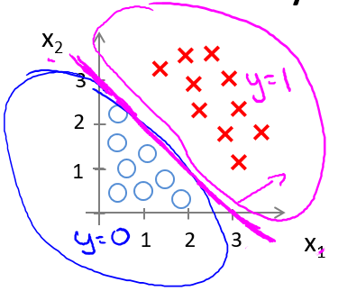
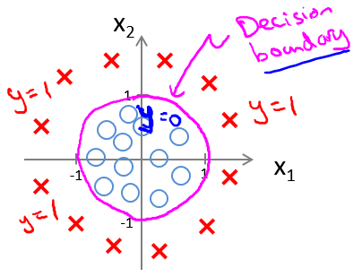
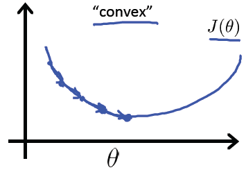
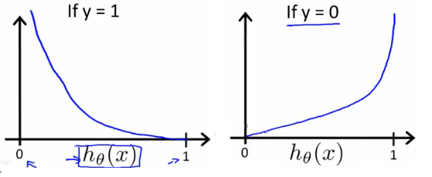

[TOC]

# 6 逻辑回归(Logistic Regression)

## 6.1 分类(Classification)

在分类问题中，预测的结果是离散值（结果是否属于某一类），逻辑回归算法(Logistic Regression)被用于解决这类分类问题。

- 垃圾邮件判断
- 金融欺诈判断
- 肿瘤诊断

讨论肿瘤诊断问题：

肿瘤诊断问题的目的是告诉病人**是否**为恶性肿瘤，是一个**二元分类问题(binary class problems)**，则定义 $ y \in\lbrace 0, 1\rbrace$，其中 0 表示**负向类(negative class)**，代表恶性肿瘤("-")，1 为**正向类(positive class)**，代表良性肿瘤("+")。如图，定义最右边的样本为**偏差项**。

在未加入偏差项时，线性回归算法给出了品红色的拟合直线，若规定

$h_\theta(x) \geqslant 0.5$ ，预测为 $y = 1$，即正向类；

$h_\theta(x) \lt 0.5$ ，预测为 $y = 0$，即负向类。

即以 0.5 为**阈值**(threshold)，则我们就可以根据线性回归结果，得到相对正确的分类结果 $y$。

接下来加入偏差项，线性回归算法给出了靛青色的拟合直线，如果阈值仍然为 0.5，可以看到算法在某些情况下会给出完全错误的结果，对于癌症、肿瘤诊断这类要求预测极其精确的问题，这种情况是无法容忍的。

不仅如此，线性回归算法的值域为 $R$，则当线性回归函数给出诸如 $h_\theta(x) = 10000, h_\theta(x) = -10000$ 等很大/很小(负数)的数值时，结果 $y \in \lbrace 0, 1\rbrace$，这显得非常怪异。

区别于线性回归算法，逻辑回归算法是一个分类算法，**其输出值永远在 0 到 1 之间**，即 $h_\theta(x) \in (0,1)$。

## 6.2 假设函数表示(Hypothesis Representation)

为了使 $h_\theta(x) \in \left(0, 1\right)$，引入逻辑回归模型，定义假设函数
$$
h_\theta \left( x \right)=g(z)=g\left(\theta^{T}x \right)
$$
对比线性回归函数 $h_\theta \left( x \right)=\theta^{T}x$，$g$ 表示逻辑函数([logistic function][1])，复合起来，则称为逻辑回归函数。

逻辑函数是 S 形函数，会将所有实数映射到 $(0, 1)$ 范围。

[sigmoid 函数][2]（如下图）是逻辑函数的特殊情况，其公式为 $g\left( z \right)=\frac{1}{1+{{e}^{-z}}}$。 

应用 sigmoid 函数，则逻辑回归模型：$$h_{\theta}(x)=g(\theta^Tx) =\frac{1}{1+e^{-\theta^Tx}}$$

逻辑回归模型中，$h_\theta \left( x \right)$ 的作用是，根据输入 $x$ 以及参数 $\theta$，计算得出”输出 $y=1$“的可能性(estimated probability)，概率学中表示为：

$\begin{align*}& h_\theta(x) = P(y=1 | x ; \theta) = 1 - P(y=0 | x ; \theta) \newline & P(y = 0 | x;\theta) + P(y = 1 | x ; \theta) = 1\end{align*}$

以肿瘤诊断为例，$h_\theta \left( x \right)=0.7$ 表示病人有 $70\%$ 的概率得了恶性肿瘤。

[1]: https://en.wikipedia.org/wiki/Logistic_function
[2]: https://en.wikipedia.org/wiki/Sigmoid_function

## 6.3 决策边界(Decision Boundary)

决策边界的概念，可帮助我们更好地理解逻辑回归模型的拟合原理。

在逻辑回归中，有假设函数 $h_\theta \left( x \right)=g(z)=g\left(\theta^{T}x \right)$。

为了得出分类的结果，这里和前面一样，规定以 $0.5$ 为阈值：

$\begin{align*}& h_\theta(x) \geq 0.5 \rightarrow y = 1 \newline& h_\theta(x) < 0.5 \rightarrow y = 0 \newline\end{align*}$

回忆一下逻辑函数的图像：

观察可得当 $g(z) \geq 0.5$ 时，有 $z \geq 0$，即 $\theta^Tx \geq 0$。

同线性回归模型的不同点在于： $\begin{align*}z \to +\infty, e^{-\infty} \to 0 \Rightarrow g(z)=1 \newline z \to -\infty, e^{\infty}\to \infty \Rightarrow g(z)=0 \end{align*}$

直观一点来个例子，${h_\theta}\left( x \right)=g\left( {\theta_0}+{\theta_1}{x_1}+{\theta_{2}}{x_{2}}\right)​$ 是下图模型的假设函数：

根据上面的讨论，要进行分类，那么只要 $ {\theta_0}+{\theta_1}{x_1}+{\theta_{2}}{x_{2}}\geq0$ 时，就预测 $y = 1$，即预测为正向类。

如果取 $\theta = \begin{bmatrix} -3\\1\\1\end{bmatrix}$，则有 $z = -3+{x_1}+{x_2}$，当 $z \geq 0$ 即 ${x_1}+{x_2} \geq 3$ 时，易绘制图中的品红色直线即**决策边界**，为正向类（以红叉标注的数据）给出 $y=1$ 的分类预测结果。

上面讨论了逻辑回归模型中线性拟合的例子，下面则是一个多项式拟合的例子，和线性回归中的情况也是类似的。

为了拟合下图数据，建模多项式假设函数：

${h_\theta}\left( x \right)=g\left( {\theta_0}+{\theta_1}{x_1}+{\theta_{2}}{x_{2}}+{\theta_{3}}x_{1}^{2}+{\theta_{4}}x_{2}^{2} \right)$

这里取 $\theta = \begin{bmatrix} -1\\0\\0\\1\\1\end{bmatrix}$，决策边界对应了一个在原点处的单位圆（${x_1}^2+{x_2}^2 = 1$），如此便可给出分类结果，如图中品红色曲线：

当然，通过一些更为复杂的多项式，还能拟合那些图像显得非常怪异的数据，使得决策边界形似碗状、爱心状等等。

简单来说，决策边界就是**分类的分界线**，分类现在实际就由 $z$ (中的 $\theta$)决定啦。

## 6.4 损失函数(Cost Function)

上节又留下了个问题，我们怎么知道决策边界是啥样？$\theta$ 多少时能很好的拟合数据？当然，见招拆招，总要来个 $J(\theta)$。

如果直接套用线性回归的损失函数： $J\left( {\theta} \right)=\frac{1}{2m}\sum\limits_{i=1}^{m}{{{\left( h_{\theta} \left({x}^{\left( i \right)} \right)-{y}^{\left( i \right)} \right)}^{2}}}$

其中 $h_\theta(x) = g\left(\theta^{T}x \right)$，可绘制关于 $J(\theta)$ 的图像，如下图

回忆线性回归中的损失函数，其是一个二次凸函数（碗状），二次凸函数的重要性质是只有一个局部最小点即全局最小点。上图中有许多局部最小点，这样梯度下降算法将无法确定收敛点是全局最优。

如果是一个凸函数，可以对其进行最优化分析，这类最优化问题，称为**凸优化问题**。还好，损失函数不止平方损失函数一种。

对于逻辑回归，更换平方损失函数为**对数损失函数：**

$\begin{align*}& J(\theta) = \dfrac{1}{m} \sum_{i=1}^m \mathrm{Cost}(h_\theta(x^{(i)}),y^{(i)}) \newline & \mathrm{Cost}(h_\theta(x),y) = -\log(h_\theta(x)) \; & \text{if y = 1} \newline & \mathrm{Cost}(h_\theta(x),y) = -\log(1-h_\theta(x)) \; & \text{if y = 0}\end{align*}$

则可绘制关于 $J(\theta)$ 的图像如下：

如左图，当训练集的结果为 $y=1$（正样本）时，随着假设函数趋向于 $1$，损失函数的值会趋于 $0$，即意味着拟合程度很好。如果假设函数此时趋于 $0$，则会给出一个**很高的损失**，拟合程度**差**，算法会根据其迅速纠正 $\theta$ 值，右图 $y=0$ 同理。

区别于平方损失函数，对数损失函数也是一个凸函数，但没有局部最优值。

## 6.5 简化的成本函数和梯度下降(Simplified Cost Function and Gradient Descent)

由于懒得分类讨论，对于二元分类问题，我们把损失函数**简化**为一个函数： 
$Cost\left( {h_\theta}\left( x \right),y \right)=-y\times log\left( {h_\theta}\left( x \right) \right)-(1-y)\times log\left( 1-{h_\theta}\left( x \right) \right)$

当 $y = 0$，左边式子整体为 $0$，当 $y = 1$，则 $1-y=0$，右边式子整体为0，也就和上面的分段函数一样了，而一个式子计算起来更方便。

$J(\theta) = - \frac{1}{m} \displaystyle \sum_{i=1}^m [y^{(i)}\log (h_\theta (x^{(i)})) + (1 - y^{(i)})\log (1 - h_\theta(x^{(i)}))]$

向量化实现：

$h = g(X\theta)$，$J(\theta) = \frac{1}{m} \cdot \left(-y^{T}\log(h)-(1-y)^{T}\log(1-h)\right)$

为了最优化 $\theta$，仍使用梯度下降法，算法同线性回归中一致：

$\begin{align*} & \text{repeat until convergence:} \; \lbrace \newline \; &{{\theta }_{j}}:={{\theta }_{j}}-\alpha \frac{\partial }{\partial {{\theta }_{j}}}J\left( {\theta}  \right) \newline \rbrace \end{align*}$

解出偏导得：

$\begin{align*}& \text{repeat until convergence:} \; \lbrace \newline \; & \theta_j := \theta_j - \alpha \frac{1}{m} \sum\limits_{i=1}^{m} (h_\theta(x^{(i)}) - y^{(i)}) \cdot x_j^{(i)} \; & \text{for j := 0,1...n}\newline \rbrace\end{align*}$

注意，虽然形式上梯度下降算法同线性回归一样，但其中的假设函不同，即$h_\theta(x) = g\left(\theta^{T}x \right)$，不过求导后的结果也相同。

向量化实现：$\theta := \theta - \frac{\alpha}{m} X^{T} (g(X \theta ) - y)$

**对数损失函数求导的推导过程：**

$J(\theta) = - \frac{1}{m} \displaystyle \sum_{i=1}^m [y^{(i)}\log (h_\theta (x^{(i)})) + (1 - y^{(i)})\log (1 - h_\theta(x^{(i)}))]$

令 $f(\theta) = {{y}^{(i)}}\log \left( {h_\theta}\left( {{x}^{(i)}} \right) \right)+\left( 1-{{y}^{(i)}} \right)\log \left( 1-{h_\theta}\left( {{x}^{(i)}} \right) \right)$

将 $h_\theta(x^{(i)}) = g\left(\theta^{T}x^{(i)} \right)=\frac{1}{1+{{e}^{-{\theta^T}{{x}^{(i)}}}}} $ 带入得

$f(\theta)={{y}^{(i)}}\log \left( \frac{1}{1+{{e}^{-{\theta^T}{{x}^{(i)}}}}} \right)+\left( 1-{{y}^{(i)}} \right)\log \left( 1-\frac{1}{1+{{e}^{-{\theta^T}{{x}^{(i)}}}}} \right)$
$=-{{y}^{(i)}}\log \left( 1+{{e}^{-{\theta^T}{{x}^{(i)}}}} \right)-\left( 1-{{y}^{(i)}} \right)\log \left( 1+{{e}^{{\theta^T}{{x}^{(i)}}}} \right)$

根据求偏导的性质，没有 $\theta_j$ 的项都消去，则得：

$\frac{\partial }{\partial {\theta_{j}}}\left( \theta^Tx^{(i)}  \right)=x^{(i)}_j$

所以有：

$\frac{\partial }{\partial {\theta_{j}}}f\left( \theta  \right)=\frac{\partial }{\partial {\theta_{j}}}[-{{y}^{(i)}}\log \left( 1+{{e}^{-{\theta^{T}}{{x}^{(i)}}}} \right)-\left( 1-{{y}^{(i)}} \right)\log \left( 1+{{e}^{{\theta^{T}}{{x}^{(i)}}}} \right)]$

$=-{{y}^{(i)}}\frac{-x_{j}^{(i)}{{e}^{-{\theta^{T}}{{x}^{(i)}}}}}{1+{{e}^{-{\theta^{T}}{{x}^{(i)}}}}}-\left( 1-{{y}^{(i)}} \right)\frac{x_j^{(i)}{{e}^{{\theta^T}{{x}^{(i)}}}}}{1+{{e}^{{\theta^T}{{x}^{(i)}}}}}$
$={{y}^{(i)}}\frac{x_j^{(i)}}{1+{{e}^{{\theta^T}{{x}^{(i)}}}}}-\left( 1-{{y}^{(i)}} \right)\frac{x_j^{(i)}{{e}^{{\theta^T}{{x}^{(i)}}}}}{1+{{e}^{{\theta^T}{{x}^{(i)}}}}}$ 
$={\frac{{{y}^{(i)}}x_j^{(i)}-x_j^{(i)}{{e}^{{\theta^T}{{x}^{(i)}}}}+{{y}^{(i)}}x_j^{(i)}{{e}^{{\theta^T}{{x}^{(i)}}}}}{1+{{e}^{{\theta^T}{{x}^{(i)}}}}}}$
$={\frac{{{y}^{(i)}}\left( 1\text{+}{{e}^{{\theta^T}{{x}^{(i)}}}} \right)-{{e}^{{\theta^T}{{x}^{(i)}}}}}{1+{{e}^{{\theta^T}{{x}^{(i)}}}}}x_j^{(i)}}$
$={({{y}^{(i)}}-\frac{{{e}^{{\theta^T}{{x}^{(i)}}}}}{1+{{e}^{{\theta^T}{{x}^{(i)}}}}})x_j^{(i)}}$
$={({{y}^{(i)}}-\frac{1}{1+{{e}^{-{\theta^T}{{x}^{(i)}}}}})x_j^{(i)}}$
$={\left({{y}^{(i)}}-{h_\theta}\left( {{x}^{(i)}} \right)\right)x_j^{(i)}}$
$={\left({h_\theta}\left( {{x}^{(i)}} \right)-{{y}^{(i)}}\right)x_j^{(i)}}$

则可得对数损失函数的导数：

$\frac{\partial }{\partial {\theta_{j}}}J(\theta) = -\frac{1}{m}\sum\limits_{i=1}^{m}{\frac{\partial }{\partial {\theta_{j}}}f(\theta)}=\frac{1}{m} \sum\limits_{i=1}^{m} (h_\theta(x^{(i)}) - y^{(i)}) \cdot x_j^{(i)} $

## 6.6 进阶优化(Advanced Optimization)

## 6.7 多类别分类: 一对多(Multiclass Classification: One-vs-all)

# 7 Regularization
## 7.1 The Problem of Overfitting

## 7.2 Cost Function

## 7.3 Regularized Linear Regression

## 7.4 Regularized Logistic Regression