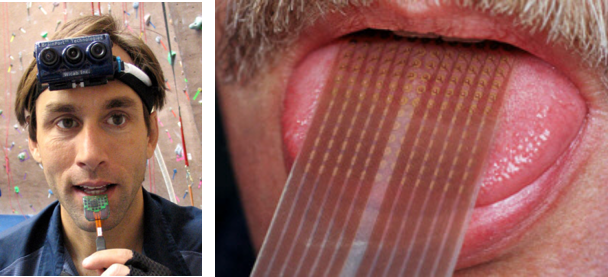
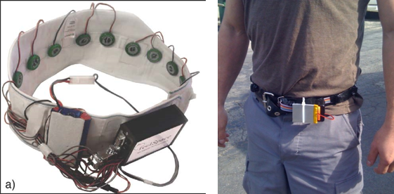

[TOC]

# 8 神经网络：表达(Neural Networks: Representation)

## 8.1 非线性假设(Non-linear Hypotheses)

理论上我们可以用多项式函数去近似任意函数，从而可得到任意问题的拟合曲线，即泰勒极数(Taylor series)。

在实际处理时，特征量通常会很多，如果再构造高阶多项式等，特征数量将会急剧增加，这使得线性模型的复杂度太高，可见并不合适。神经网络无需构造高阶多项式，在特征量很大时也可以处理的很好。

那特征能有多大呢？下面是一个计算机视觉中的例子：

如上图，如果选取一小块 $50 * 50$ 像素的灰度图片（一个像素只有亮度一个值），选择每个像素点作为特征，则特征总量 $n=2500$（换成 RGB（一个像素有三个值），则 $n = 7500$），如果将其两两组合作为新特征，则特征数量将为 $C_{2500}^{2} \approx 3\ million$。

## 8.2 神经网络和大脑(Neurons and the Brain)

脑科学家通过对动物实验，发现大脑中专用于处理听觉信号的脑皮层也能处理其他诸如视觉等信号，即如果切断其与耳朵的联系，将其与眼睛相连，则这块负责听觉的脑皮层区域也能接受并处理视觉信号，从而学会“看”。脑科学家通过这类换源实验，就推论假设大脑的学习算法只有一种(“one learning algorithm” hypothesis)。那么如果能找出这种学习算法并应用于计算机中，那梦想中和人一样的人工智能就成真了。

神经网络就源于**模拟人类大脑**，但其需要的计算量很大。随着计算机硬件性能的提高，神经网络逐渐从衰落变为流行，如今已广泛地被应用在各行各业中。

下图是根据研究做的一些应用（有兴趣可回顾视频）：

BrainPort  系统：帮助失明人士通过摄像头以及舌尖感官“看”东西

触觉皮带：在朝北时蜂鸣器会发出声响，可使人拥有方向感（声音信号转换为方向信号）。

## 8.3 模型表示1(Model Representation I)

## 8.4 模型表示2(Model Representation II)

## 8.5 例子和直观理解1(Examples and Intuitions I)

## 8.6 例子和直观理解2(Examples and Intuitions II)

## 8.7 多类别分类(Multiclass Classification)